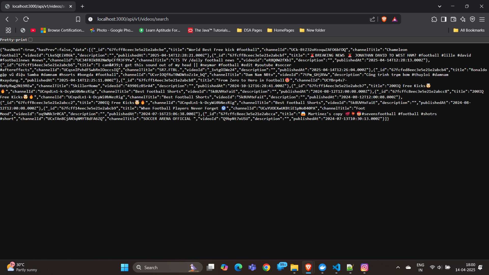

# FamPay Backend Developer Assignment

## Project Overview

This project is aimed at building a scalable API that fetches and stores the latest YouTube videos for a given search query, offering features like pagination, search, and automatic handling of API key quotas. The project is dockerized, optimized for performance, and includes a basic search API for querying stored video data.

---

## Table of Contents

1. Project Goals
2. How to Run the Project
3. API Documentation
4. Environment Variables
5. Notes

---

## Project Goals

### Basic Requirements

- [x] Fetch and store video details using YouTube API (title, description, publish date, thumbnails, etc.).
- [x] Implement a **GET API** for retrieving stored video data in a paginated format, sorted by publishing date in descending order.
- [x] Implement a basic **search API** that allows querying videos by title or description.
- [x] Dockerize the entire project for easy deployment and scalability.
- [x] Ensure that the project is optimized for performance and scalability.

### Bonus Features

- [x] Support multiple YouTube API keys to automatically switch to the next available key when one quota is exhausted.
- [ ] Build a **dashboard** to view and manage the stored videos (optional).
- [x] Optimize the **search API** to support partial matches for video title or description.

---

## How to Run the Project

### Prerequisites

- Node.js (Recommended version: LTS)
- Docker (optional, if you prefer to run with Docker)

### Steps

1. **Clone the repository:**

   git clone https://github.com/MohammadBasharAfzal/FamPay_API_Assignment.git

2. **Install dependencies:**

   Navigate to the project folder and install the required Node.js packages.

   cd FamPay_API_Assignment
   npm install

3. **Configure environment variables:**

   Copy the `.env.example` file to `.env.dev` and fill in the required values (e.g., YouTube API keys, database credentials).

   cp .env.example .env.dev

   **Important:** Make sure to add your YouTube API keys to the `YOUTUBE_API_KEYS` field in the `.env.dev` file, like so:

   YOUTUBE_API_KEYS="Key1,Key2,Key3"

4. **Run the project:**

   - To run the project **without Docker**:

     npm run start:dev

   - To run the project **with Docker**:

     Ensure Docker is installed, then run:

     docker-compose up

---

## API Documentation

### `GET /api/v1/videos/search`

This API retrieves a paginated list of videos stored in the database. It can also filter results based on search queries for video title or description.

#### Query Parameters:

- **page**: The page number for pagination (default: `1`).
- **pageSize**: The number of items per page (default: `10`).
- **sortBy**: The field by which to sort the results (default: `publishedAt`).
- **search** (optional): A search term to filter the results by video title or description (supports partial matches).

#### Example Request:

GET http://localhost:3000/api/v1/videos/search?page=1&pageSize=10&sortBy=publishedAt&search=football

#### Response:

{
  "hasNext": true,
  "hasPrev": false,
  "data": [
    {
      "id": "1",
      "title": "How to play football",
      "description": "A complete guide on playing football.",
      "publishedAt": "2025-04-01T12:00:00Z",
      "thumbnails": {
        "url": "http://example.com/thumbnail1.jpg"
      }
    },
    ...
  ]
}

---

## Screenshots of the Application

### API Responses
Here is a screenshot showing the API response when fetching video data:

### Logs 
Here is a screenshot of logs:

---

## Environment Variables

- **YOUTUBE_API_KEYS**: A comma-separated list of YouTube API keys to use for requests.
- **MONGO_URI**: MongoDB connection string (required for storing video data).
- **PORT**: The port on which the server should run (default: `3000`).

---

## Notes

- The YouTube API has quota limitations, so multiple keys are supported to ensure continuous fetching of videos when the quota for one key is exhausted.
- The project includes an interval-based background process that fetches the latest videos at a regular interval (default: every 10 seconds).

---

